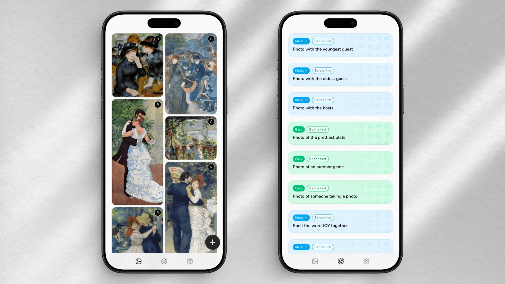

# Event Photo Challenges



A configurable, mobile-first event gallery with collaborative photo challenges. It runs as a React app and API on Cloudflare Workers, stores originals in R2, tracks challenge completion in KV, and can build multilingual download archives with GitHub Actions.

The design is deliberately neutral: adapt it for a birthday, reunion, conference, festival, wedding, or another private event.

> [!NOTE]
> This repository is published as-is as a reference project. It is not actively maintained.

## Features

- Responsive masonry gallery
- Localized photo challenges with difficulty levels and submission limits
- Multilingual support (English and German)
- Image resizing through Cloudflare Image Transformations
- Captioned challenge-photo downloads
- Optional streaming ZIP archives that do not fill the GitHub runner disk

## Requirements

- Node.js 22 or newer
- pnpm 10
- A Cloudflare account for deployment
- Two R2 buckets, one KV namespace, and a Workers Images binding for all features

## Local development

```sh
pnpm install
cp .dev.vars.example .dev.vars
pnpm run dev
```

Local development uses Wrangler's local R2 and KV simulations. `CDN_BASE_URL` is empty by default, so local image requests use `/api/photo-objects/*`.

Useful commands:

```sh
pnpm run test
pnpm run lint
pnpm run build
pnpm run check
pnpm run check:deploy
pnpm run i18n
```

## Customize the event

Most installations only need to edit [`src/shared/event-config.ts`](src/shared/event-config.ts). Its exported `EventConfig` and `ChallengeConfig` types cover:

- Event name, description, onboarding copy, default locale, and filename slug
- Hero path and accessible alternative text
- Primary colors
- Caption label and archive filename prefix
- Challenge IDs, English/German captions, difficulty, icons, reward emojis, and optional submission limits

For example:

```ts
{
  id: "friend-selfie",
  difficulty: "easy",
  icon: "camera",
  rewardEmojis: ["📸", "🎉"],
  maxSubmissions: 10,
  caption: {
    de: "Mach ein Selfie mit deinen Freunden",
    en: "Take a selfie with your friends",
  },
}
```

The build rejects duplicate or malformed IDs, missing translations, unknown icons, and invalid limits. Add a new icon name to both `CHALLENGE_ICON_NAMES` and the frontend icon map. UI copy that is not event-specific remains under `src/app/i18n`; run `pnpm run i18n` after changing its shape.

Replace `public/hero.webp` and the favicon/PWA assets in `public/` with assets you have permission to redistribute. Adjust the remaining design tokens in `src/app/index.css` for more extensive themes.

The starter supports `de` and `en`. Removing or adding a locale requires updating `SUPPORTED_LOCALES`, the UI translation dictionaries, locale loader, and archive definitions together.

## Cloudflare setup

The `wrangler.json` file contains example resource names, an intentionally invalid all-zero KV namespace ID, an example application URL, and no CDN. Replace them before deployment. The binding names are part of the application code; the resource names and IDs point those bindings at resources in your Cloudflare account.

### Resource bindings

| Setting                         | What it is used for                                                                                                                          | Where to get the value                                                                                                                                                                                                                                |
| ------------------------------- | -------------------------------------------------------------------------------------------------------------------------------------------- | ----------------------------------------------------------------------------------------------------------------------------------------------------------------------------------------------------------------------------------------------------- |
| `name`                          | The deployed Worker name. It also becomes part of the default `workers.dev` URL.                                                             | Choose a unique name, or use the name of an existing Worker shown under **Workers & Pages** in the Cloudflare dashboard.                                                                                                                              |
| `PHOTOS.bucket_name`            | The private R2 bucket containing original guest uploads.                                                                                     | Create a bucket under **R2 Object Storage**, or use `pnpm wrangler r2 bucket create <name>`. Copy the bucket name exactly.                                                                                                                            |
| `PHOTO_DERIVATIVES.bucket_name` | A separate R2 bucket for captioned images, archive ZIP files, the caption font, and archive dirty markers.                                   | Create a second R2 bucket in the dashboard or with Wrangler and copy its name. Do not point both bindings at the same bucket.                                                                                                                         |
| `CHALLENGES.id`                 | The KV namespace that records which client-generated participant has completed which challenge. It does not contain authentication sessions. | Run `pnpm wrangler kv namespace create CHALLENGES` and copy the returned namespace ID, or copy the ID from **Storage & Databases → KV** in Cloudflare.                                                                                                |
| `IMAGES`                        | A Cloudflare Images binding used to inspect, resize, and add captions to challenge photos. It is a binding name rather than an API key.      | Keep the binding name `IMAGES`. Make sure Images is available for the Cloudflare account. `remote: false` keeps normal local development local; set it to `true` only when you intentionally want local development to use the remote Images service. |

The application expects the binding names `PHOTOS`, `PHOTO_DERIVATIVES`, `CHALLENGES`, and `IMAGES`. You can rename them, but must also update `src/worker/env.d.ts` and every corresponding `env.*` reference.

### Runtime variables

These values are not secrets and live under `vars` in `wrangler.json`. `.dev.vars` supplies local overrides and is ignored by Git; `.dev.vars.example` contains safe defaults.

| Variable                   | What it controls                                                                                                                                                      | Value to use                                                                                                                                                                                                                                                    |
| -------------------------- | --------------------------------------------------------------------------------------------------------------------------------------------------------------------- | --------------------------------------------------------------------------------------------------------------------------------------------------------------------------------------------------------------------------------------------------------------- |
| `APP_BASE_URL`             | The public base URL of the app and API. Caption generation fetches originals through `${APP_BASE_URL}/api/photo-objects/...`, so this must reach the deployed Worker. | Use the URL printed by `wrangler deploy`, such as `https://<worker>.<account-subdomain>.workers.dev`, or the custom domain attached to the Worker. Do not use the R2 or Bunny hostname here. Omit a trailing slash.                                             |
| `CDN_BASE_URL`             | The public hostname from which gallery images are loaded.                                                                                                             | Leave it empty to proxy originals through the Worker. For direct Cloudflare delivery, use the custom domain attached to the `PHOTOS` bucket. When using Bunny, use the Pull Zone hostname or its custom hostname. Include `https://` and omit a trailing slash. |
| `IMAGE_TRANSFORM_PROVIDER` | Tells the URL builder whether it should add Cloudflare's `/cdn-cgi/image/...` resizing path.                                                                          | Use `none` when `CDN_BASE_URL` is empty or does not support Cloudflare transformation URLs. Use `cloudflare` when the CDN origin is a Cloudflare photo domain with Image Transformations enabled, including when Bunny sits in front of that domain.            |

If the first deploy is needed to discover the final `workers.dev` URL, deploy once, copy the printed URL into `APP_BASE_URL`, and deploy again before accepting uploads.

1. Create storage resources:

   ```sh
   pnpm wrangler r2 bucket create your-event-photos
   pnpm wrangler r2 bucket create your-event-photo-derivatives
   pnpm wrangler kv namespace create CHALLENGES
   ```

2. Put the bucket names and returned KV namespace ID in `wrangler.json`.

3. Set `APP_BASE_URL` to the deployed Worker or custom domain. Large captioned images fetch their resized source through this URL.

   The checked-in Images binding uses `remote: false` so the gallery can start locally without Cloudflare credentials. Set it to `true` and run `pnpm wrangler login` when testing caption generation against the remote Images service.

4. Choose image delivery:
   - Simple origin mode: leave `CDN_BASE_URL` empty and set `IMAGE_TRANSFORM_PROVIDER` to `none`.
   - Direct Cloudflare delivery: attach a custom domain such as `images.example.com` to the `PHOTOS` R2 bucket, enable Image Transformations for that Cloudflare zone, set the domain as `CDN_BASE_URL`, and set the provider to `cloudflare`. The public `r2.dev` development URL is not a replacement for a custom domain when using transformations.
   - Bunny in front of Cloudflare: complete the direct Cloudflare setup first, then follow the Bunny instructions below.

5. Verify and deploy:

   ```sh
   pnpm run check
   pnpm run check:deploy
   pnpm run deploy
   ```

If using transformations, verify that a URL shaped like this returns an image:

```text
https://cdn.example.com/cdn-cgi/image/width=720,quality=74,format=webp,fit=scale-down,metadata=none/<photo-key>.jpg
```

### Optional Bunny CDN

Bunny is useful here as a delivery layer, not as another storage system or image processor. The original deployment added it because direct Cloudflare image delivery was unacceptably slow for me in Germany, particularly over Deutsche Telekom. Bunny gives the browser a different edge network while retaining Cloudflare R2 and Image Transformations as the origin stack.

The request path becomes:

```text
browser → Bunny Pull Zone → Cloudflare image custom domain → R2
```

Cloudflare performs the `/cdn-cgi/image/...` transformation. Bunny caches that final transformed response close to the visitor, so repeated gallery and lightbox requests do not normally travel through the problematic direct route.

To configure it:

1. First verify direct Cloudflare transformation URLs on the custom domain attached to the `PHOTOS` bucket.
2. In Bunny, [create a Pull Zone](https://bunny.net/docs/cdn/quickstart.md). Set its origin URL to the Cloudflare photo domain, for example `https://images.example.com`. Do not use the Worker `APP_BASE_URL` as the origin.
3. Use the generated `https://<pull-zone>.b-cdn.net` hostname, or add a custom hostname to the Pull Zone and configure the requested CNAME and TLS certificate.
4. Leave Bunny Optimizer and Bunny's image transformation features disabled. The application already encodes width, quality, format, and metadata removal into Cloudflare's URL; processing it again adds cost and can reduce image quality.
5. Let Bunny respect/cache the origin response. [Origin Shield](https://bunny.net/docs/cdn/performance/origin-shield.md) can reduce repeat requests from Bunny to Cloudflare, but is optional.
6. Set the Worker variables to:

   ```json
   {
     "APP_BASE_URL": "https://photos.example.com",
     "CDN_BASE_URL": "https://your-pull-zone.b-cdn.net",
     "IMAGE_TRANSFORM_PROVIDER": "cloudflare"
   }
   ```

7. Redeploy and inspect a gallery image URL. It should start with the Bunny hostname while retaining the Cloudflare transformation path:

   ```text
   https://your-pull-zone.b-cdn.net/cdn-cgi/image/width=720,quality=74,format=webp,fit=scale-down,metadata=none/<photo-key>.jpg
   ```

Test from the networks your guests will actually use; a fast desktop connection on another ISP may not reveal a Telekom-specific routing problem. Compare both the direct Cloudflare URL and Bunny URL before paying for the extra layer.

Photo object keys are immutable, which makes long caching safe for normal uploads. Deleting an R2 object removes it from the app, but an already cached copy may remain directly reachable until CDN caches expire or are purged. If a photo must become unavailable immediately, [purge its URL from Bunny](https://bunny.net/docs/cdn/purge-cache.md) and Cloudflare after deleting it.

## Captioned photos and archives

Challenge uploads generate English and German captioned variants in the derivatives bucket.

`GET /api/photo-archive` reports archive status and locale-specific URLs. Downloads use:

- `GET /api/photo-archive/de.zip`
- `GET /api/photo-archive/en.zip`

The archive builder runs in GitHub Actions rather than inside the Worker, so it uses Cloudflare's S3-compatible R2 API. Configure these under **GitHub repository → Settings → Secrets and variables → Actions**:

| GitHub setting          | Type     | What it is and where to get it                                                                                                                                                                                                                            |
| ----------------------- | -------- | --------------------------------------------------------------------------------------------------------------------------------------------------------------------------------------------------------------------------------------------------------- |
| `R2_ACCOUNT_ID`         | Secret   | The Cloudflare account ID used to construct the R2 S3 endpoint. Find it in the Cloudflare dashboard's R2 overview under account details.                                                                                                                  |
| `R2_ACCESS_KEY_ID`      | Secret   | The access-key ID shown after [creating an R2 API token](https://developers.cloudflare.com/r2/api/tokens/). In Cloudflare, open **R2 Object Storage → Manage R2 API Tokens** and create a token with object read/write access limited to the two buckets. |
| `R2_SECRET_ACCESS_KEY`  | Secret   | The matching secret access key shown when the R2 API token is created. Cloudflare only displays it once; copy it directly into the GitHub secret and never commit it.                                                                                     |
| `R2_PHOTOS_BUCKET`      | Variable | The exact `PHOTOS.bucket_name` from `wrangler.json`. This is not sensitive.                                                                                                                                                                               |
| `R2_DERIVATIVES_BUCKET` | Variable | The exact `PHOTO_DERIVATIVES.bucket_name` from `wrangler.json`. This is not sensitive.                                                                                                                                                                    |

The Worker itself does not need the three archive credentials: its R2 bindings provide resource access. The API token exists only so the external GitHub runner can list, read, write, and delete the archive-related R2 objects. Keep the token scoped to the two buckets.

The workflow is manual by default so a fresh fork does not fail or create costs. Run it once with **Run workflow** to create the initial archives. To rebuild periodically, uncomment the schedule in `.github/workflows/photo-archive.yml`.

Uploads and deletions write durable dirty markers under `archive-events/`. The builder skips current archives, streams replacements directly to R2, retains old downloads until uploads complete, and deletes only markers that existed when the build began. If captioned variants are missing, it fails rather than silently omitting them.

## Security and privacy

This starter is open by design. There are no accounts or invite checks:

- Anyone who can reach the deployment can list, view, download, and upload photos.
- R2/CDN image URLs and ZIP archives are public. Do not use this repository for confidential photos without adding authentication at the Worker and CDN layers.
- Display names are visible to every visitor. Internal participant IDs and deletion credentials are not returned by gallery APIs.
- Each upload returns a random deletion key. Only its hash is stored in R2; the browser stores the key locally. Clearing browser storage or changing devices removes the guest's ability to delete that photo. Admins can always delete objects in Cloudflare.
- Participant IDs discourage accidental duplicate challenge entries but are client-generated game state, not identity or authorization.

## API notes

- `GET /api/photos` lists public photo metadata without participant IDs or deletion secrets.
- `POST /api/photos` accepts an image, display name, date, and optional challenge information. Its response includes a one-time `deletionToken`.
- `DELETE /api/photos/:key` requires `Authorization: Bearer <deletionToken>`.
- `GET /api/challenges?userId=...` returns game progress for a client-generated participant ID.
- `GET /api/photo-archive` returns locale-specific archive metadata.

These APIs are intentionally small and are not a substitute for an authenticated media service.

## License

The project is available under the [MIT License](LICENSE).
